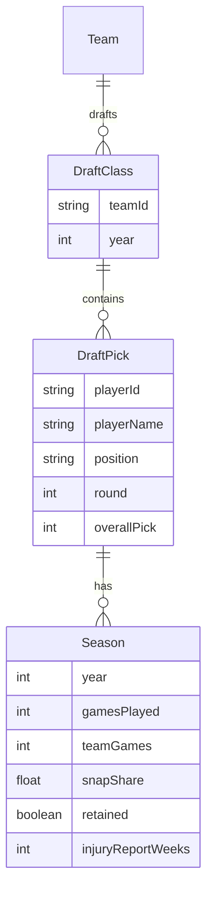

# Data Model

Data structures for `/data/*.json` and TypeScript types.

## Schema Overview



## TypeScript Types

```ts
export interface Season {
  year: number;
  gamesPlayed: number;
  teamGames: number;
  snapShare: number;
  retained: boolean;
  /** Weeks on official injury report (nflverse injuries data). Optional. */
  injuryReportWeeks?: number;
}

export interface DraftPick {
  playerId: string;
  playerName: string;
  position: string;
  round: number;
  overallPick: number;
  teamId: string;
  espnId?: string;
  seasons: Season[];
}

export interface Team {
  id: string;
  name: string;
  abbreviation: string;
}

export interface DraftClass {
  year: number;
  picks: DraftPick[];
}
```

## JSON Layout

**Recommendation:** One file per year, all teams — `public/data/draft-{year}.json`.

Team-centric view filters client-side.

### Example: draft-2023.json

```json
{
  "year": 2023,
  "picks": [
    {
      "playerId": "00-0033873",
      "playerName": "Patrick Mahomes",
      "position": "QB",
      "round": 1,
      "overallPick": 10,
      "teamId": "KC",
      "espnId": "3139477",
      "seasons": [
        {
          "year": 2017,
          "gamesPlayed": 1,
          "teamGames": 16,
          "snapShare": 0.02,
          "retained": true
        },
        {
          "year": 2018,
          "gamesPlayed": 16,
          "teamGames": 16,
          "snapShare": 0.98,
          "retained": true
        }
      ]
    }
  ]
}
```

### Minimal Example (for testing)

```json
{
  "year": 2023,
  "picks": [
    {
      "playerId": "p1",
      "playerName": "Test Player",
      "position": "WR",
      "round": 1,
      "overallPick": 5,
      "teamId": "KC",
      "seasons": [
        {
          "year": 2023,
          "gamesPlayed": 15,
          "teamGames": 17,
          "snapShare": 0.72,
          "retained": true
        }
      ]
    }
  ]
}
```

## Team Metadata

32 teams with id, name, abbreviation. IDs align with nflverse (e.g. KC, BUF, LAR). Include franchise history for retention: OAK→LV, SD→LAC, STL→LAR.
