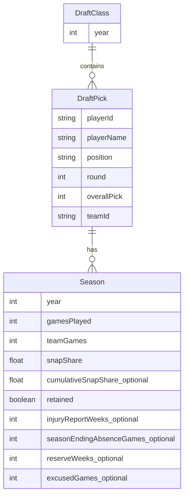

# Data Model

Data structures for `public/data/draft-{year}.json` and TypeScript types in `src/types.ts`.

## Schema Overview


```mermaid
erDiagram
    DraftClass ||--o{ DraftPick : contains
    DraftPick ||--o{ Season : has

    DraftClass {
        int year
    }

    DraftPick {
        string playerId
        string playerName
        string position
        int round
        int overallPick
        string teamId
    }

    Season {
        int year
        int gamesPlayed
        int teamGames
        float snapShare
        float cumulativeSnapShare_optional
        boolean retained
        int injuryReportWeeks_optional
        int seasonEndingAbsenceGames_optional
        int reserveWeeks_optional
        int excusedGames_optional
    }
```

## TypeScript Types

```ts
export type Role =
  | 'core_starter'
  | 'starter_when_healthy'
  | 'significant_contributor'
  | 'contributor'
  | 'depth'
  | 'non_contributor';

export interface Season {
  year: number;
  gamesPlayed: number;
  teamGames: number;
  snapShare: number;
  /** Season load (player snaps / primary team full-season capacity; see calculations.md). Stored capped at `snapShare` when computed load would exceed it. Optional on older files. */
  cumulativeSnapShare?: number;
  retained: boolean;
  /** Weeks on official injury report (nflverse injuries data). Optional. */
  injuryReportWeeks?: number;
  /** Team games missed after the player's last snap — an injury that ended his season. Present only when non-zero; a player on IR leaves the injury report, so these seasons have no `injuryReportWeeks`. */
  seasonEndingAbsenceGames?: number;
  /** Weeks on a reserve list (nflverse weekly rosters) — the direct IR measurement. Present only when non-zero, and only from 2016 on. Era-exclusive with `seasonEndingAbsenceGames`: a season carries one or the other, never both — 2016+ writes `reserveWeeks`, 2013–2015 writes `seasonEndingAbsenceGames`. */
  reserveWeeks?: number;
  /** Games the load denominator actually forgave for injury: `| missedWeeks ∩ (injury-report weeks ∪ reserve weeks) |` (see `src/lib/absenceWeeks.ts`). Present only when non-zero. The authoritative figure — consumers must read this rather than re-derive it from `injuryReportWeeks` / `reserveWeeks`, which count documented weeks, not games lost, and disagree with the stored score. */
  excusedGames?: number;
}

export interface DraftPick {
  playerId: string;
  playerName: string;
  position: string;
  round: number;
  overallPick: number;
  teamId: string;
  espnId?: string;
  /** NFL headshot URL from nflverse players */
  headshotUrl?: string;
  seasons: Season[];
}

export interface Team {
  id: string;
  name: string;
  abbreviation: string;
}

export interface DraftClass {
  year: number;
  picks: DraftPick[];
}
```

## JSON Layout

**Recommendation:** One file per year, all teams — `public/data/draft-{year}.json`.

Team-centric view filters client-side.

### Example: draft-2023.json

```json
{
  "year": 2023,
  "picks": [
    {
      "playerId": "00-0033873",
      "playerName": "Patrick Mahomes",
      "position": "QB",
      "round": 1,
      "overallPick": 10,
      "teamId": "KC",
      "espnId": "3139477",
      "headshotUrl": "https://static.www.nfl.com/image/upload/...",
      "seasons": [
        {
          "year": 2017,
          "gamesPlayed": 1,
          "teamGames": 16,
          "snapShare": 0.02,
          "retained": true
        },
        {
          "year": 2018,
          "gamesPlayed": 16,
          "teamGames": 16,
          "snapShare": 0.98,
          "retained": true,
          "injuryReportWeeks": 2
        }
      ]
    }
  ]
}
```

### Minimal Example (for testing)

```json
{
  "year": 2023,
  "picks": [
    {
      "playerId": "p1",
      "playerName": "Test Player",
      "position": "WR",
      "round": 1,
      "overallPick": 5,
      "teamId": "KC",
      "seasons": [
        {
          "year": 2023,
          "gamesPlayed": 15,
          "teamGames": 17,
          "snapShare": 0.72,
          "retained": true
        }
      ]
    }
  ]
}
```

## Team Metadata

32 teams with id, name, abbreviation. IDs align with nflverse (e.g. KC, BUF, LAR). Include franchise history for retention: OAK→LV, SD→LAC, STL→LAR.
